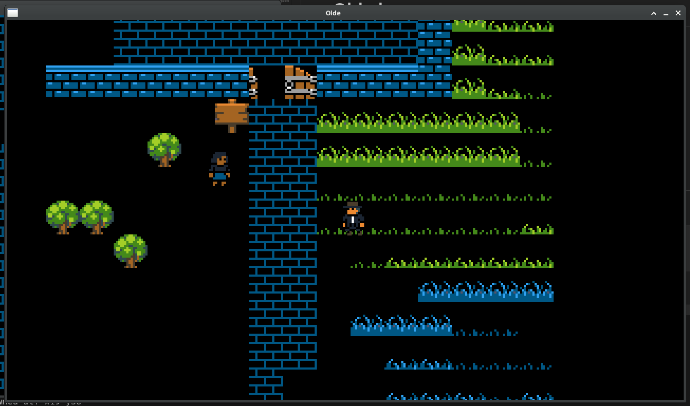

# YeOldeWorld

Welcome to the YeOldeWorld game/prototype

inspired by oldschool nes rpg - 8bit graphics, 16x16 tilesets, simple controls.

this is multiplayer only rpg, one could say real-time roguelike, but please don't - it's not.

# Olde has:

- handcrafted maps - that can be big as 4096x4096 tiles loaded on host and networked to players
- dedicated host using ENet - 4 (more in the future) players
- oldschool nes vibe (simpler the better)
  

network library is ENet https://github.com/zpl-c/enet
graphics library is Raylib https://github.com/raysan5/raylib

graphics assets are https://opengameart.org/content/simple-broad-purpose-tileset

# Preview:

# Compilation:

please provide following compiled static libraries to src/

        - libraylib.a - from raylib
        - libenet.a   - from zpl-c/enet
        
and header files into src/inc/

        - raylib.h
        - enet.h

then:

- make
- make install (for game installation)
- make install_editor
- make install_server
- make clean

Windows compilation is not available at the moment, Olde is developed under Fedora Linux